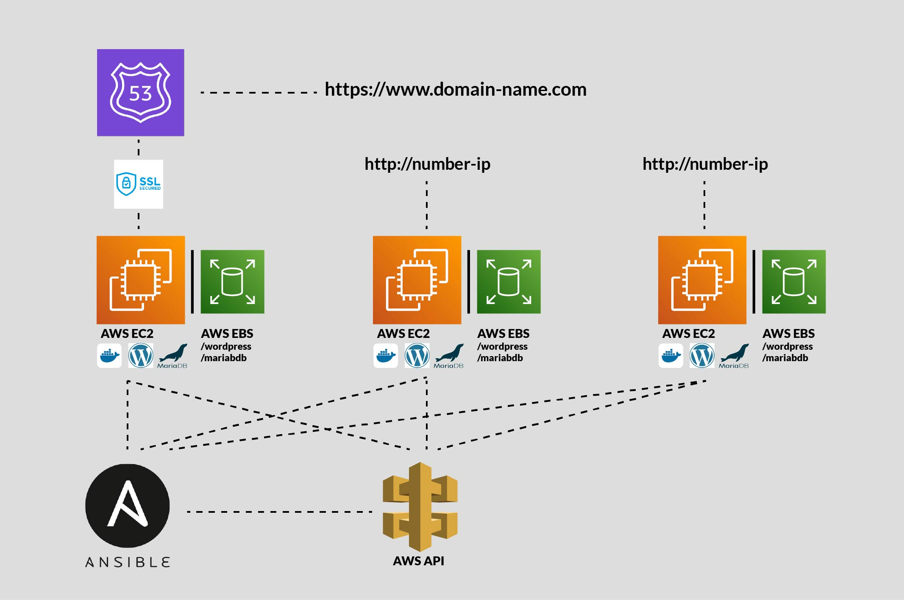

# cloud-1
Automate deployment (for example on AWS EC2) via Ansible and its Inventory



## You will need

- one AWS account
- one AWS IAM account with AWS Access key and relevant EC2 permissions
- one EC2 keypair with `400` permissions on the private .pem key (else Ansible scolds you about it)

# Story
AWS as a cloud provider lets you deploy your product. In fact clouds have become the default way of deployment. AWS lets you host something in a VM with a public IPv4 assigned (default port 80/443).

## Create a VM manually first
When you interact with the AWS dashboard, even on the free tier you are able to initiate and run an instance of EC2, an established and distinguished VM product, during which an IPv4 is assigned to it. You can even learn how to automate this later, check out the script `AWS_create_ec2.yaml`

## Access the hosted VM
as admin vs. as client

### SSh into a VM
```bash
ssh -i key.pem ubuntu@"ip"
```

This is for admin stuff (that's you!) and for this, you will first need to set up a keypair through AWS dashboard. It's GUI, so much more user-friendly than `ssh-keygen`.

### Call resources as client
`{ip}:{port}{uri}`

## Is an EC2 instance really a VM or rather a container?
The necessity of EBS for data persistence nudges us towards rather thinking in containers. Amazon itself just calls them "instances". Start an instance of EBS per instance of EC2.

## Ansible: automating deployment
Ansible is neither the most modern tool nor specialized in deployment, but was recommended by the assignment. And it is fluent (B1) in AWS terminology, or rather it becomes through installation of the ansible collection. See [Makefile](./Makefile) for `ansible-galaxy collection install amazon.aws`.